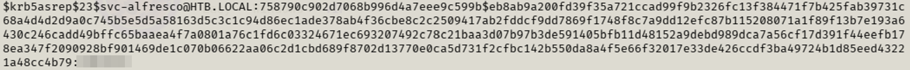
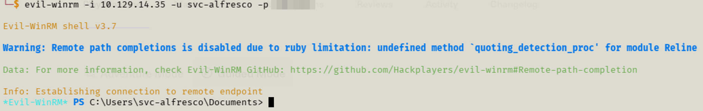
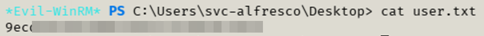
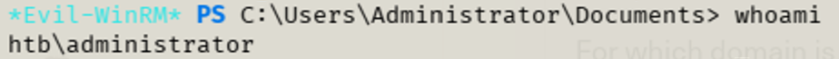
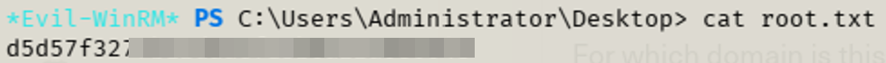

+++
date = '2026-04-07'
draft = false
title = 'HTB - Forest'
toc = true
tags = ['Walkthrough', 'Hack The Box']
+++

# Introduction

Hello and welcome to my first walkthrough. I’m going over Hack the Box’s _Forest_ box. While working on this box, I learned about AS-REP roasting and DACL attacks. I’m still new to the red-team world so all of this was new and exciting to learn about! Throughout this writeup, you’ll see me use [IP] as a placeholder for the IP of the machine. This is because I had to reset it daily as I get ~30 minutes a day to work on these boxes.

## Initial Enumeration

Every environment I work in immediately starts with an Nmap scan. This allows me to see what devices are on the network, their running services and information about those services. The Nmap command I run is

```bash
nmap -A -p- -T 4 [IP]
```

The -A flag provides OS detection (-O flag), version detection (-sV flag) and runs default scripts against the endpoint (-sC flag). The default scripts look for things like SSL cert info, SMB info and HTTP titles. The -A flag also performs a traceroute from the attacking machine to the remote machine. This allows you to see how data gets from the attacking machine to the remote machine and can be useful.

The -p- flag scans all 65,535 TCP ports. By default, Nmap only scans the first 1000 most common ports. The remaining 64,535 ports could be in use, and you won’t know it by using the default options. By using the -p- flag, we’re able to enumerate all the ports and see if something is running on a non-standard port. In the past, I’ve encountered HTTP running on non-standard ports that have allowed me to compromise the machine.

The -T flag controls the speed at which Nmap performs the scan. You can choose a number between 1 (slow) and 5 (fast). Depending on the environment, you may want to slow things down to avoid detection. I’ve found that -T 4 is the “sweet spot” for labs.

Now that I’ve described my initial Nmap scan, let’s get to the results.

```bash
Starting Nmap 7.95 ( https://nmap.org ) at 2026-02-18 07:29 CST
Nmap scan report for 10.129.1.45
Host is up (0.031s latency).
Not shown: 65512 closed tcp ports (reset)
PORT      STATE SERVICE      VERSION
53/tcp    open  domain       Simple DNS Plus
88/tcp    open  kerberos-sec Microsoft Windows Kerberos (server time: 2026-02-18 13:36:18Z)
135/tcp   open  msrpc        Microsoft Windows RPC
139/tcp   open  netbios-ssn  Microsoft Windows netbios-ssn
389/tcp   open  ldap         Microsoft Windows Active Directory LDAP (Domain: htb.local, Site: Default-First-Site-Name)
445/tcp   open  microsoft-ds Windows Server 2016 Standard 14393 microsoft-ds (workgroup: HTB)
464/tcp   open  kpasswd5?
593/tcp   open  ncacn_http   Microsoft Windows RPC over HTTP 1.0
636/tcp   open  tcpwrapped
3268/tcp  open  ldap         Microsoft Windows Active Directory LDAP (Domain: htb.local, Site: Default-First-Site-Name)
3269/tcp  open  tcpwrapped
5985/tcp  open  http         Microsoft HTTPAPI httpd 2.0 (SSDP/UPnP)
|_http-server-header: Microsoft-HTTPAPI/2.0
|_http-title: Not Found
9389/tcp  open  mc-nmf       .NET Message Framing
47001/tcp open  http         Microsoft HTTPAPI httpd 2.0 (SSDP/UPnP)
|_http-title: Not Found
|_http-server-header: Microsoft-HTTPAPI/2.0
49664/tcp open  msrpc        Microsoft Windows RPC
49665/tcp open  msrpc        Microsoft Windows RPC
49666/tcp open  msrpc        Microsoft Windows RPC
49668/tcp open  msrpc        Microsoft Windows RPC
49670/tcp open  msrpc        Microsoft Windows RPC
49676/tcp open  ncacn_http   Microsoft Windows RPC over HTTP 1.0
49677/tcp open  msrpc        Microsoft Windows RPC
49683/tcp open  msrpc        Microsoft Windows RPC
49698/tcp open  msrpc        Microsoft Windows RPC
Device type: general purpose
Running: Microsoft Windows 2016|2019
OS CPE: cpe:/o:microsoft:windows_server_2016 cpe:/o:microsoft:windows_server_2019
OS details: Microsoft Windows Server 2016 or Server 2019
Network Distance: 2 hops
Service Info: Host: FOREST; OS: Windows; CPE: cpe:/o:microsoft:windows

Host script results:
| smb-security-mode:
|   account_used: guest
|   authentication_level: user
|   challenge_response: supported
|_  message_signing: required
| smb2-time:
|   date: 2026-02-18T13:37:14
|_  start_date: 2026-02-18T13:34:06
| smb2-security-mode:
|   3:1:1:
|_    Message signing enabled and required
| smb-os-discovery:
|   OS: Windows Server 2016 Standard 14393 (Windows Server 2016 Standard 6.3)
|   Computer name: FOREST
|   NetBIOS computer name: FOREST\x00
|   Domain name: htb.local
|   Forest name: htb.local
|   FQDN: FOREST.htb.local
|_  System time: 2026-02-18T05:37:13-08:00
|_clock-skew: mean: 2h45m57s, deviation: 4h37m09s, median: 5m55s
```

Upon initial inspection, I can tell this is a Windows Server and is a domain controller by the following ports: 88, 389, 636, and 3268. Port 88 is Kerberos and is used for authentication. Ports 389, 636, and 3268 are all related to LDAP. Port 636 is LDAPS, a secure version of LDAP.

I can see that the server is also a file share by ports 139 and 445. Port 139 is SMB over NetBIOS while port 445 is SMB over TCP. Knowing that the -A flag from our scan performs basic scripts, I can see what information SMB provides to us. Looking at the script results, the following information is gathered:

- Anonymous authentication to view shares is available

- SMB signing is enabled

- SMB2 and SMB3 are used, SMB1 is disabled

- It is a Windows Server 2016 standard OS

- Hostname of the machine is FOREST

- The domain is htb.local

All this information was gained just from my Nmap scan and some basic scripts being ran.

There are two HTTP services running on ports 5985 and 47001. At the time, I hadn’t investigated any of the other ports. Little did I know port 5985 would be a huge port for me.

Now that I’ve discussed my initial enumeration, I’ll dive into each service and how I enumerated those services.

## SMB
If I see SMB open, I typically start there. From my Nmap scan, I see that I can connect anonymously. The command I use is

```bash
smbclient -L \\\\[IP] --option ‘client min protocol=SMB2’
```

The -L flag lists the shares that remote machine has. Knowing the box used SMB2/SMB3, I had to throw on the option to use SMB2 otherwise it wouldn’t connect.

Using smbclient, I was able to list the different shares that were available. Unfortunately, I didn’t have permission to access any of them.

## HTTP
In this case, I tried to navigate to the machine’s HTTP services by using [IP]:[port]. Again, neither service was accessible. If they would have been, I would have tried directory busting to see what was available.

## LDAP
From my previous courses that I’ve taken, I hadn’t had to enumerate LDAP, so this was a new one for me. I learned that Linux has an LDAP enumeration tool called enum4linux. This neat little tool provides a ton of information from the remote box. I created a TXT file and added all the enumerated usernames to it. Once I got to this point, I wasn’t quite sure what path to go down. Going back to my PEH notes, I ran through different things, but nothing worked. I decided to check the hint, and it mentioned AS-REP roasting. Again, this was a new concept, so I did some investigating.

## AS-REP Roasting
So, what exactly is AS-REP Roasting? Well, it deals with the Kerberos process and how a user account has been configured in Active Directory. Kerberos works by a client requesting authentication from the Key Distribution Center (KDC). The KDC is a trusted component of a domain controller that is responsible for authenticating users and issuing Kerberos tickets.

The user requests a ticket-granting ticket. The KDC verifies the user’s identity and provides a ticket granting ticket and session key. The key is encrypted using a key based derived from the user’s password. For AS-REP roasting, this is as far as we need to go with the Kerberos process.

When setting up users in Active Directory, there is an option for pre-authentication. Pre-authentication requires that the client verifies it knows the password before the server provides the ticket granting ticket. When that is disabled, the server doesn’t do any verification and simply replies to the attacking machine with data encrypted using the user’s key. This allows an attacker to capture that data and attempt to crack it offline to recover the user’s password. AS-REP Roasting takes advantage of this process.

Having a basic idea of what AS-REP roasting is now, I investigated the process of utilizing this flaw in an attack. My investigation led to using netexec to perform an AS-REP Roast. The command I used was:

```bash
sudo netexec ldap [DC IP] -u users.txt -p ‘’ — asreproast hashes.txt — verbose — kdc [DC IP]
```

That successfully gathered a hash for the user svc-alfresco. From there, I threw the hash into hashcat and cracked the password. The command I used for hashcat was:

```bash
hashcat -m 18200 -a 0 -o cracked.txt hashes.txt /usr/share/wordlists/rockyou.txt
```



## Next Steps
Alright, I have credentials. Now what? I started over with checking SMB with my newly acquired credentials. The command I used was

```bash
smbclient \\\\[IP]\[share] -U htb/svc-alfresco — option ‘client min protocol=SMB2’
```

I tried for each of the shares available and still didn’t have permission. I tried a couple of others things to no avail. After some assistance in brainstorming *cough*AI*cough*, port 5985 came into play. As I mentioned earlier, I didn’t know at the time but that port could be abused as it is WinRM.

## WinRM
What is WinRM? It is a service that Windows utilizes that allows remote commands to be executed. This allows you to manage Windows systems remotely without having physical access to them. If you’re familiar with SSH and Linux, then this is the Window’s version of that. WinRM typically runs on port 5985, for HTTP, and 5986, for HTTPS.

After looking into ways to abuse WinRM, I came across a tool called evil-winrm. This tool allows you to connect to WinRM from the attacking machine. To successfully use evil-winrm, you need to have WinRM open (I did), have valid credentials (I do now), and the target must allow authentication. Knowing that I have the requirements, I gave it a shot. I used the following command

```bash
evil-winrm -i 10.129.95.210 -u svc-alfresco -p [PASSWORD]
```



I was now in and had gained a foothold. Since this is a CTF, I immediately went and captured the user flag.



## DACL
I’ve captured the flag, great, now what? Well, it’s time to gain admin and finish the box. Reaching into my Windows privilege escalation notes, I tried a few things but got nowhere with them. Since I’m still new, I took a hint from the box. It mentioned write permissions on the DACL. What is a DACL? DACL stands for Discretionary Access Control List. At a basic level, it controls what an entity has access to. It utilizes access control entries (ACEs). ACEs define whether a user or group is allowed or denied access. If no ACE is present, access is denied by default.

So how do we abuse this? If you have write permissions, you can modify the DACL permissions that can lead to privilege escalation. This can be done by adding users to a privileged group or granting replication permission.

## Enumeration
So how can we enumerate for write permissions on the DACL? I tried two ways: BloodHound and Impacket. I’ll admit, I haven’t had the best luck using BloodHound since it updated to the Community Edition. This was a good way to continue to work on wrapping my mind around it.

## BloodHound
If you’re not familiar with what BloodHound is, it is a great tool for mapping Active Directory. Once you have a set of valid credentials, you can use those to map the AD environment, see how things are connected and what potential vulnerabilities there are. There are a few steps to get things set up, collect data and visualize it, but I’m going to skip over those.

I collected the data from the target machine, thanks to evil-winrm, and imported it into BloodHound. I started with the compromised account and saw that it is a member of the privileged IT accounts group and account operators group. Through the operator group, our user has permissions to create and add users to groups.

## Domain Takeover
Since I know I can add users to groups, I decided to go down that path. I added my compromised user to the Exchange Windows Permissions group by using the following command

```bash
net rpc group addmem “Exchange Windows Permissions” SVC-ALFRESCO -U “HTB.LOCAL/SVC-ALFRESCO%s3rvice” -S 10.129.95.210
```

This group can modify ACLs within Active Directory. I then used a tool called [PowerView](https://raw.githubusercontent.com/PowerShellMafia/PowerSploit/master/Recon/PowerView.ps1) and ran it on the remote machine.

PowerView, in this case, modified the AD ACLs. This allows me to set up the compromised account to perform a DCSync attack, which replicates the AD environment to my machine. During the replication, the hashes of users are sent to my machine.

I ran the following command to utilize PowerView and add DCSync permissions to my user:

```
$username = “htb\svc-alfresco”;
$password = "s3rvice";
$secstr = New-Object -TypeName System.Security.SecureString;
$password.ToCharArray() | ForEach-Object {$secstr.AppendChar($_)};
$cred = New-Object System.Management.Automation.PSCredential($username, $secstr);
Add-DomainObjectAcl -Credential $cred -PrincipalIdentity 'svc-alfresco' -TargetIdentity 'HTB.LOCAL\Domain Admins' -Rights DCSync
```

To run a DCSync, I use the following command on my attacking machine:

```bash
impacket-secretsdump HTB.LOCAL/SVC-ALFRESCO:s3rvice@FOREST.htb.local
```


And with that I have the hash for the domain admin. From there I’m able to use the hash to get into the domain controller.

```bash
evil-winrm -i 10.129.95.210 -u Administrator -H [HASH]
```

From there, I was able to full compromise the domain and capture the flag.




## Conclusion
Overall, I needed a good amount of assistance on this box. I had never enumerated LDAP or modified DACLs before. I’ve updated my notes so I’ll be more prepared to identify attack paths and use similar techniques in the future.
