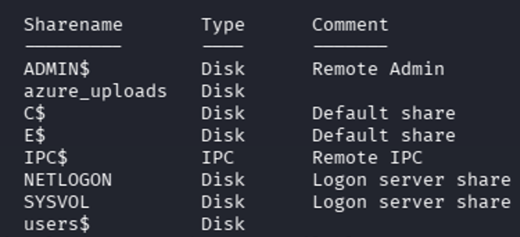
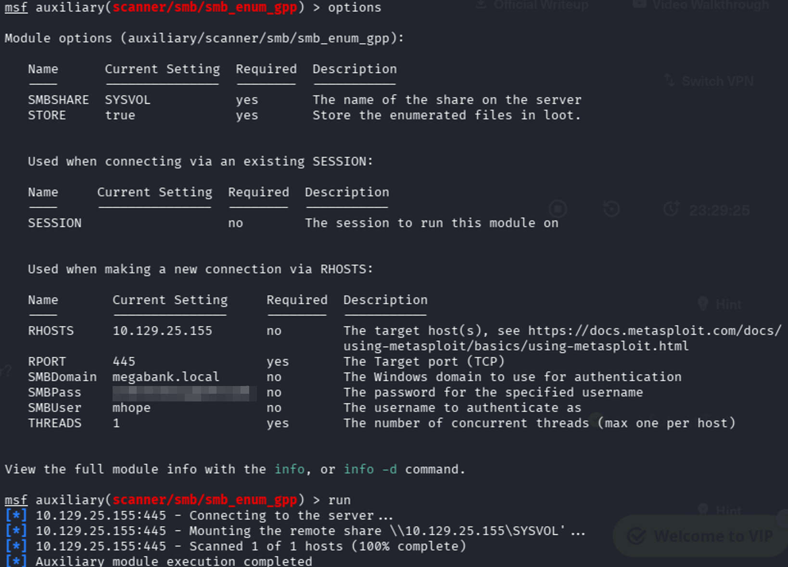
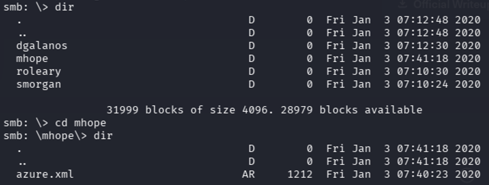
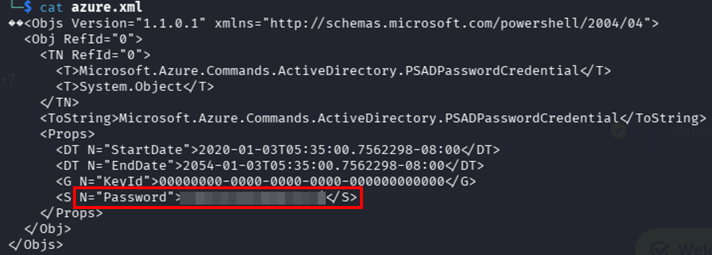
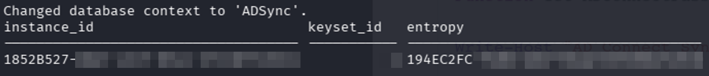

+++
date = '2026-05-01'
draft = false
title = 'HTB - Monteverde'
toc = true
tags = ['Walkthrough', 'Hack The Box']
+++

## Introduction
Hello again! This write up is going over Hack the Box’s _Monteverde_. I worked through most of the box independently but relied on the walkthrough for the final steps. We’ll get into more detail as we get there.

## Nmap
As always, we start with an Nmap scan.

```bash
Nmap scan report for 10.129.228.111
Host is up (0.030s latency).
Not shown: 65517 filtered tcp ports (no-response)
PORT      STATE SERVICE       VERSION
53/tcp    open  domain        Simple DNS Plus
88/tcp    open  kerberos-sec  Microsoft Windows Kerberos (server time: 2026-04-12 15:46:13Z)
135/tcp   open  msrpc         Microsoft Windows RPC
139/tcp   open  netbios-ssn   Microsoft Windows netbios-ssn
389/tcp   open  ldap          Microsoft Windows Active Directory LDAP (Domain: MEGABANK.LOCAL0., Site: Default-First-Site-Name)
445/tcp   open  microsoft-ds?
464/tcp   open  kpasswd5?
593/tcp   open  ncacn_http    Microsoft Windows RPC over HTTP 1.0
636/tcp   open  tcpwrapped
3268/tcp  open  ldap          Microsoft Windows Active Directory LDAP (Domain: MEGABANK.LOCAL0., Site: Default-First-Site-Name)
3269/tcp  open  tcpwrapped
5985/tcp  open  http          Microsoft HTTPAPI httpd 2.0 (SSDP/UPnP)
|_http-server-header: Microsoft-HTTPAPI/2.0
|_http-title: Not Found
9389/tcp  open  mc-nmf        .NET Message Framing
49667/tcp open  msrpc         Microsoft Windows RPC
49673/tcp open  ncacn_http    Microsoft Windows RPC over HTTP 1.0
49674/tcp open  msrpc         Microsoft Windows RPC
49676/tcp open  msrpc         Microsoft Windows RPC
49696/tcp open  msrpc         Microsoft Windows RPC
Warning: OSScan results may be unreliable because we could not find at least 1 open and 1 closed port
Device type: general purpose
Running (JUST GUESSING): Microsoft Windows 2019|10 (97%)
OS CPE: cpe:/o:microsoft:windows_server_2019 cpe:/o:microsoft:windows_10
Aggressive OS guesses: Windows Server 2019 (97%), Microsoft Windows 10 1903 - 21H1 (91%)
No exact OS matches for host (test conditions non-ideal).
Network Distance: 2 hops
Service Info: Host: monteverde; OS: Windows; CPE: cpe:/o:microsoft:windows

Host script results:
| smb2-time: 
|   date: 2026-04-12T15:47:06
|_  start_date: N/A
| smb2-security-mode: 
|   3:1:1: 
|_    Message signing enabled and required
```

Looking through the results, I notice that I’m dealing with another Windows Domain Controller. I also note that SMB and WinRM are open.

## LDAP
Right away I attempt to enumerate LDAP. I use enum4linux as my trusty tool. It provides a ton of information regarding the target’s setup. I go through looking for information that is immediately pertinent; domain and usernames. Thanks to this enumeration, I know the domain is megabank.local. Moving on to attacks, I created a TXT file and entered the usernames.

```bash
mhope
SABatchJobs
svc-ata
svc-bexec
svc-netapp
dgalanos
roleary
smorgan
```

I went on my AS-REP Roasting to see if that was an option. Unfortunately, it didn’t return anything.

Knowing AS-REP Roasting wasn’t an option, I continued to look through the output of enum4linux. Since no obvious attack paths appeared in the short time before boarding a plane, I decided to try and brute force credentials. I ended up using Hydra and the rockyou file to see if I could get an easy win while flying.

```bash
hydra -L users.txt -P /usr/share/wordlists/rockyou.txt [Remote_Box_IP] ldap -s 389
```

With the brute force attacking being unsuccessful, I thought about deeper LDAP enumeration. While thinking, I realized that I could target the user descriptions. If I could enumerate the description field for each user, there might be a chance I could find a password hidden away.

To do this, I found a tool called ldapsearch. Ldapsearch allows you to query anything using the LDAP service. In this case, it is Active Directory.

```bash
ldapsearch -x -H ldap://[Remote_Box_IP] -b "DC=MEGABANK,DC=LOCAL" "(&(objectClass=user)(description=*))" description
```

To keep the flag descriptions short and simple:

- x — anonymous authentication

- H — the target server

- b — the base distinguished name (DN)

  - This is the path that you want to search

  - The base DN defines the directory path (CN, OU, DC structure)

- “(&(objectClass=user)(description=*))” description — The thing I’m looking for, in this case it is user descriptions

I ran this command and it didn’t return any useful information. Now that I’ve exhausted that option, I needed to move on.

At this point, a clear attack path wasn’t revealing itself. I decided to review the hint provided by the box. The hint mentioned that a user’s password was their username. Since there were so few users, I decided to manually try each account. If there were more users, I would figure out a way to script the attempts.

I attempted to log into the target machine via Evil-WinRM with each set of credentials. Lo and behold, I was successful with the SABatchJobs account. This was the initial foothold I needed to launch into deeper enumeration and eventual domain compromise. Now I can shift my focus to privilege escalation. This confirmed weak credential hygiene within the domain and suggested other misconfigurations might exist.

I decided to take a slightly different angle on further enumeration that I have on the previous two boxes. I fired up ldapdomaindump. This tool allows the attacker to use valid credentials and map out Active Directory.

```bash
sudo /usr/bin/ldapdomaindump ldaps:// [Remote_Box_IP] -u 'megabank.local\ SABatchJobs' -p SABatchJobs
```

This outputs the files into a bunch of HTML and JSON files. These files are then grouped into different categories, such as users, groups and users in groups. I like to start with domain_users_by_group.html as it shows the users and their respective groups. While scanning through that, a user had extra permissions: mhope. This user belonged to the Azure Admins group. I now know my next target.

## BloodHound
I fired up BloodHound and extracted data from the domain controller. I still ran BloodHound to validate relationships visually and cross-check my findings.

```bash
sudo bloodhound-python -d megabank.local -u SABatchJobs -p SABatchJobs -ns [Remote_Box_IP] -c all
```

BloodHound is a good tool for mapping Active Directory and seeing what paths exist between users/groups and privilege escalation options. I marked SABatchJobs as owned and looked for different paths to the server or even mhope. Nothing of importance came up.

## SMB
Knowing that SMB was open and I had valid credentials, I started to dig into the SMB share. Initially, I just listed what shares were available.

```bash
smbclient -L \\\\[Remote_Box_IP] -U sabatchjobs - password SABatchJobs - option 'client min protocol=SMB2'
```



Initially, I tried to perform a Group Policy Preferences (GPP) attack and see if there were any passwords saved in group policy that could be used to escalate. This attack focuses on GPO preferences and scans for any passwords that may be saved. The passwords are encrypted; however, Microsoft had released the public key which allows the data to be decrypted. I wasn’t successful, but I’ll detail the method to perform this attack.

Open Metasploit (msfconsole) and run the smb_enum_gpp module. Enter the pertinent information and run it. It will connect to the server with the credentials provided and scan SYSVOL for credentials.



After my attempt with the GPP attack, I manually enumerated the rest of the shares. Of interest was the users$ share, particularly mhope. I dug into his share, as it was available to access. Within there I came across an azure.xml file. This exposed credentials in cleartext, which is a critical misconfiguration and a common real-world finding. Another win! My focus is privilege escalation toward domain admin now.




## Running into Trouble
I repeated the same enumeration steps listed before, but with mhope, in hopes that his permissions would provide different data that my SABatchJobs account. Lo and behold, this did not reveal any additional attack paths.

After exhausting those options, I attempted a Kerberoasting attack to identify any service accounts that could be leveraged for privilege escalation.

Kerberoasting targets accounts associated with Service Principal Names (SPNs). When a domain user requests a service ticket (TGS) for one of these services, the ticket is encrypted using the service account’s password hash. This allows an attacker to request the ticket and then attempt to crack it offline.

I used Impacket’s GetUserSPNs.py to enumerate any accounts with SPNs and request their associated tickets.

```bash
sudo GetUserSPNs.py megabank.local/mhope:[password] -dc-ip [Remote_Box_IP] -request
```

However, this did not return any results, indicating that there were no Kerberoastable accounts available with my current access. I then pivoted to a different approach for privilege escalation.

With no clear path, I shifted my focus to the Entra ID Sync tool for potential privilege escalation. This tool syncs on-prem Active Directory data to Entra ID and stores credentials for that process.

Initially, I discovered a script called adconnectdump. This tool was created to extract credentials from the Sync database. It can run remotely, similar to ldapdomaindump, but this approach was unsuccessful.

To run the script on the target machine, I copied the Python script over. I verified that Python was not installed. I discovered that Python has an embeddable option. This allows Python to run without installation, which is useful when local administrative permissions are not available. I transferred the embeddable Python file to the target machine and ran the adconnectdump script.

The script did not perform as expected. This ended up being due to different Entra ID Sync versions. The script was made for newer versions of the Sync tool while the one installed on the target machine was older.

I referred to the walkthrough and confirmed that I was on the right track. Within the walkthrough, it is mentioned that there is a script available for older versions of the software. There are a few preparation steps needed to get the new script functioning.

I need to extract the instance_id, keyset_id and entropy from the existing database. This data will allow me to decrypt any password used for syncing.

```bash
sqlcmd -S MONTEVERDE -Q "use ADsync; select instance_id,keyset_id,entropy from mms_server_configuration"
```



After modifying the script, I was able to successfully decrypt the credentials stored within Entra ID Sync. This occurs because Entra ID Sync often stores highly privileged service account credentials. This highlights how synchronization services can unintentionally expose domain-level credentials if not properly secured.


I used Evil-WinRM with my new credentials as verification and successfully logged in. Once logged in, I captured the flag.


To recap, here is the attack path:

LDAP Enumeration -> Weak Credentials -> SMB share exposure -> Credential Discovery -> Entra ID Sync abuse -> Domain compromise.

## Wrap Up - My Thoughts
I’m learning that as soon as I feel that I’m starting to grasp concepts and break into boxes, something comes along and proves I’m not. I had been stuck on working through the Entra ID Sync for most of the time I spent on this box. Regardless, this is all about learning and improving little by little. I would much rather spend time studying and practicing on things harder than the actual exam. That was my mindset with the CISSP and the actual exam was easier compared to the material I had been studying from.

Overall, I’m continuing to move forward, learn new things and begin to implement what I’m learning as I’m moving forward. Two boxes ago, I had no idea that Evil-WinRM was a tool and now I’m using it all the time. One key takeaway from this box is to always consider Entra ID Sync as a high-value target in hybrid environments.

Small progress is still progress.
